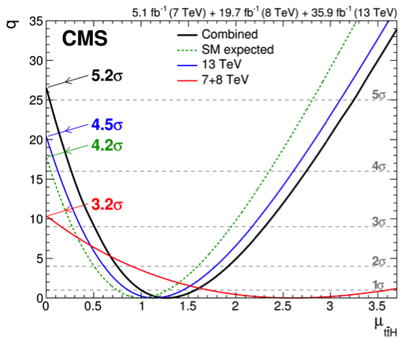

# Caractérisation du boson de Higgs

## Couplage au quark top

Dans le Modèle Standard, le boson de Higgs peut se coupler aux fermions, avec un couplage proportionnel à la masse du fermion. Alors que les désintégration du boson de Higgs en paires de leptons tau et de quarks b ont été observées, la désintégration en paire de quarks top n'est pas possible, car mH < 2 mt.
Le couplage du boson de Higgs au quark top peut néanmoins être mesuré car il intervient dans le processus de production du boson de Higgs en association avec une paire top-antitop (ttH).

Ce mécanisme de production a été observé pour la première fois avec les données en 2018, en combinant les données issues du Run 1 et du Run 2 (jusqu’en 2016). La figure 1 montre que le signal est observé avec une significance de 5.2σ, et compatible avec les prédictions du modèle standard.

Le groupe CMS de l’IPNL contribue à l’analyse du canal multi-leptons (ciblant principalement la production ttH avec désintégration du boson de Higgs en paire de bosons W), et participe aux techniques d’analyse avancées qui sont employées dans la mesure. En particulier, le groupe s'intéresse à la méthode des éléments de matrice, qui consiste à évaluer la compatibilité de chaque événement de collision avec l'élément de matrice de la section efficace du processus ttH, puis à utiliser cette probabilité dans l'analyse statistique fournissant la mesure du couplage. 

*Figure 1: Évolution du rapport de vraisemblance en fonction d'un facteur multiplicatif appliqué à la section efficicace du processus ttH dans le modèle standard.*

## Maxime