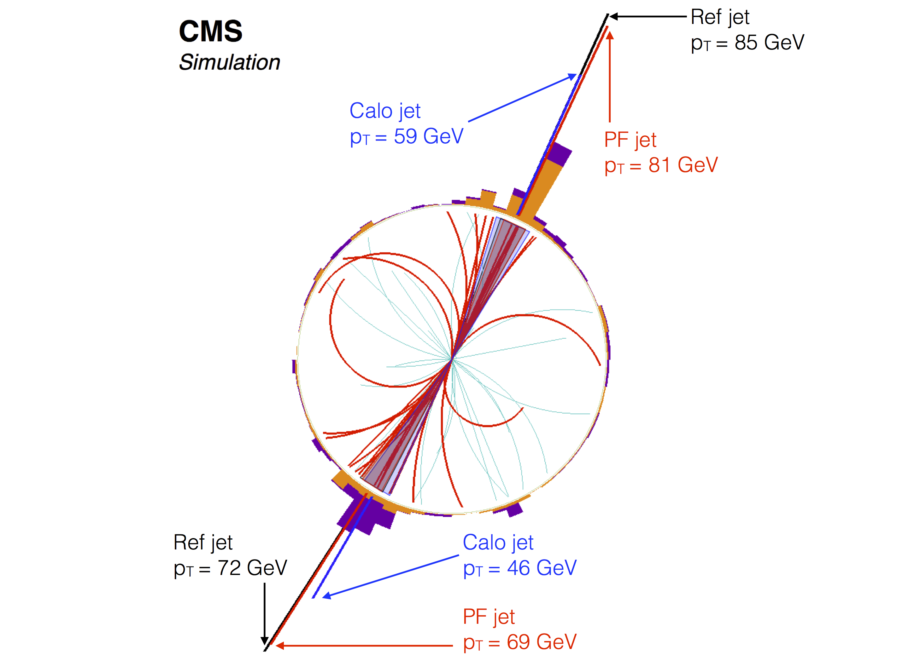
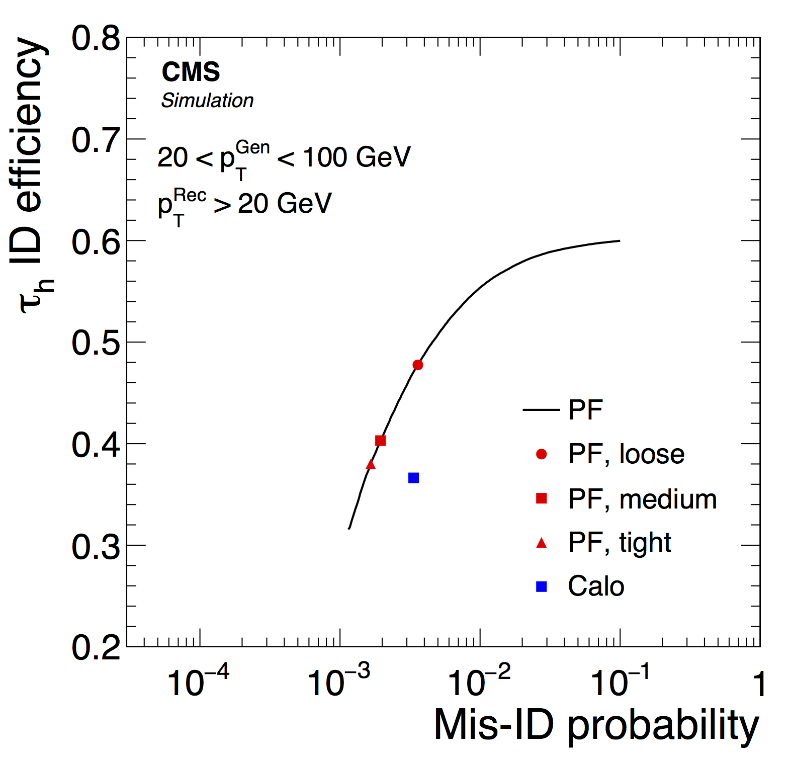

# Reconstruction du flux de particules

Toutes les analyses de CMS sont basées sur la reconstruction du flux de particules (PF) qui combine de manière optimale les informations collectées par chacun des sous-détecteurs pour identifier et reconstruire individuellement les particules de l'état final: hadrons chargés, hadrons neutres, photons, électrons, et muons. 
Ainsi, les hadrons chargés sont reconstruits par une combinaison des informations du trajectographe et des calorimètres, dominée par la précision du trajectographe même au sein de jets d'énergie supérieure au TeV. Les photons et les électrons sont quand à eux reconstruits avec une grande précision dans le ECAL, et les muons par une combinaison des chambres à muons et du trajectographe. 

Les objets de physique de haut niveau (jets, énergie transverse manquante, taus, etc.) sont ensuite construits à partir de la liste des particules reconstruites, 
qui constitue une description globale et cohérente de l'événement. 
Par exemple, des jets de particules sont obtenus en amassant les particules reconstruites au lieu des dépôts d'énergie dans les calorimètres.
Les hadrons chargés et les photons emportant en moyenne environ 90\% de l'énergie d'un jet, la résolution sur la mesure de l'énergie et de la direction des jets, ainsi que leur réponse en énergie, s'en trouvent nettement améliorée.
La figure 1 montre les jets reconstruits à partir des particules du PF dans un événement di-jet. Cet événement, représentatif des performances du PF, montre que les jets de particules reconstruites fournissent une estimation beaucoup plus précise de l'énergie et de la direction des jets que les jets reconstruits uniquement à partir des des dépôts calorimétriques. 

 
*Figure 1: Reconstruction des jets dans un événement QCD di-jet.
Les particules amassées dans les deux jets sont affichées avec une ligne plus épaisse.
Par souci de clarté, les particules de pT<1 GeV ne sont pas montrées.
L'impulsion transverse des PF jets est indiquée par une ligne radiale, et comparée avec celle des jets de particules générées (Ref) et des jets calorimétriques (Calo).
Aucune correction en énergie des jets n'est appliquée pour illustrer les différences de réponse en énergie pour les jets bruts.* 

Le PF, en reconstruisant les particules résultant de la désintégration des leptons taus et en quantifiant leur isolation par rapport aux autres particules de l'événement, permet d'identifier les taus avec une efficacité 10% supérieure à celle de la méthode d'identification utilisée auparavant pour une même pureté, comme illustré sur la figure 2.

Après avoir joué un rôle moteur dans la création de l'algorithme de reconstruction du flux de particules au cours des quinze dernières années, les membres de l'équipe CMS de l'IPNL ont conduit l'analyse et la rédaction de l'[article de référence](https://arxiv.org/abs/1706.04965) décrivant cet algorithme et ses performances.

