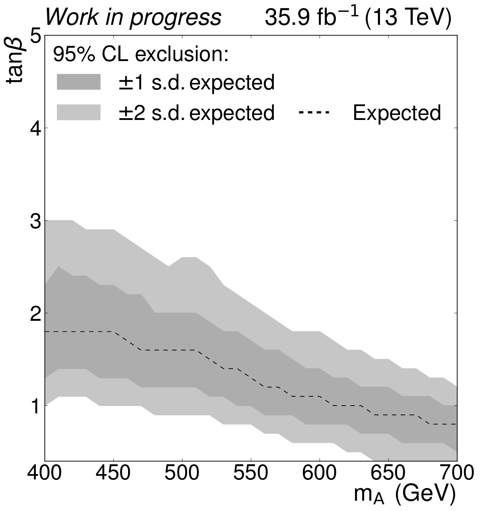

Le LHC pendant le Run-II s’est montré une usine à quarks top. L’étude de la physique du top est capitale pour la compréhension du Modèle Standard (MS) et pour sonder la présence de nouvelle physique au-delà du Modèle lui-même. Dans ce domaine, beaucoup d'intérêt est dédié à la recherche des nouvelles particules se désintégrant en paires de quark top à travers la reconstruction de la masse invariante du système de deux quark top dans l’état final.
Cette analyse est de primordiale importance car un certain nombre de modèles qui étendent le MS prévoient la présence des résonances se couplant au quark top, notamment modèles de technicolor, d'extra dimensions ou avec la présence de bosons de Higgs additionnels. Les signatures expérimentales peuvent être différentes selon le modèle que l'on considère et le spin de la particule considérée. 

En particulier toute phénoménologie avec de particules de spin 0 (tel qu’un boson de Higgs neutre lourd prédit par les modèles à deux doublets de Higgs) se désintégrant en paires de quarks top doit tenir en compte de la possibilité d’interférence avec la production de paires de quarks top du MS, ce qui déforme la distribution de masse invariante et complique considérablement la mise en évidence d'un signal de nouvelle physique. Un signal issu d’une telle topologie peut en effet se manifester dans le spectre de masse invariante des paitres de quarks top comme la combinaison d’un excès et d’un déficit d’événements, par rapport au MS. 

Le groupe CMS de l’IPNL a été pionnier dans ce domaine au sein de CMS, en mettant en place une méthode de géneration d'événements simulés dédiée, ainsi que des nouvelles méthodes d’analyse pour découvrir un tel signal dans les données et pour évaluer les contraintes que pourraient avoir des mesures éventuelles sur les modèles théoriques. C'est en effet le groupe CMS de l'IPNL qui a initié cette activité, au sein de CMS, en considérant la désintégration sémi-leptonique des paires de quarks top. D'autres groupes au sein de CMS ont rejoint cet effort par la suite, se dédiant au canal di-leptonique et confirmant l'intérêt du sujet. Dans ce contexte, le groupe de l'IPNL a pris naturellement le rôle de leader de ces recherches au sein de CMS.

L’analyse, qui combine les résultats du canal semi-leptonique et di-leptonique pour une meilleure sensibilité, a été finalisée pour les données à 13TeV et un papier se trouve dans les dernières étapes de revue interne à la collaboration avant la publication. La Figure 1 montre les zones que l’analyse serait capable d’exclure, dans le cas de non observation du signal. En effet, ce genre de recherches, quand elles ne parviennent pas à mettre en évidence des phénomènes au delà du MS, permettent tout de même de contraindre les modèles théorique, ce qui représente un avancement de la connaissance. La Figure est produite dans une hypothèse particulière d’un modèle et les axes représentent deux paramètres importants de ce modèle. Les valeurs observées sur les données ne sont pas montrées pour des raisons de confidentialité. Ces résultats ont un fort impact pour contraindre les modèles de physique au delà du MS. 

*Figure 1 : zone exclue par l’analyse, dans le cas de non observation du signal. Les axes répresentent deux paramètres importants du modèle considéré.*
